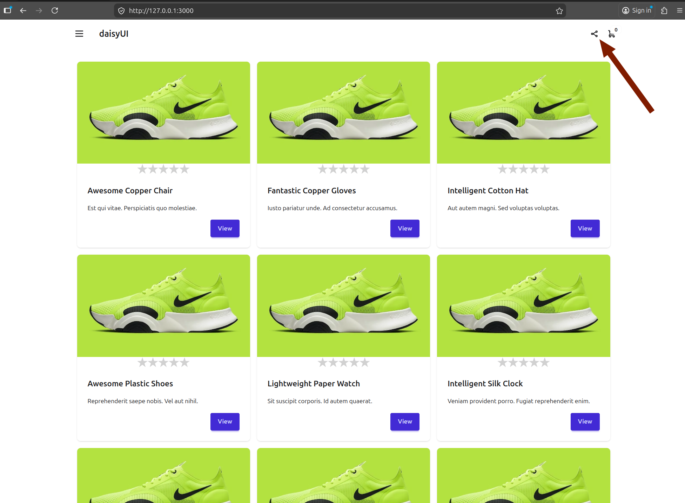
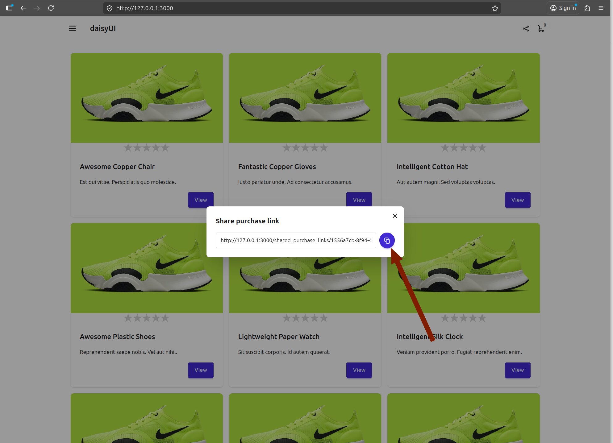
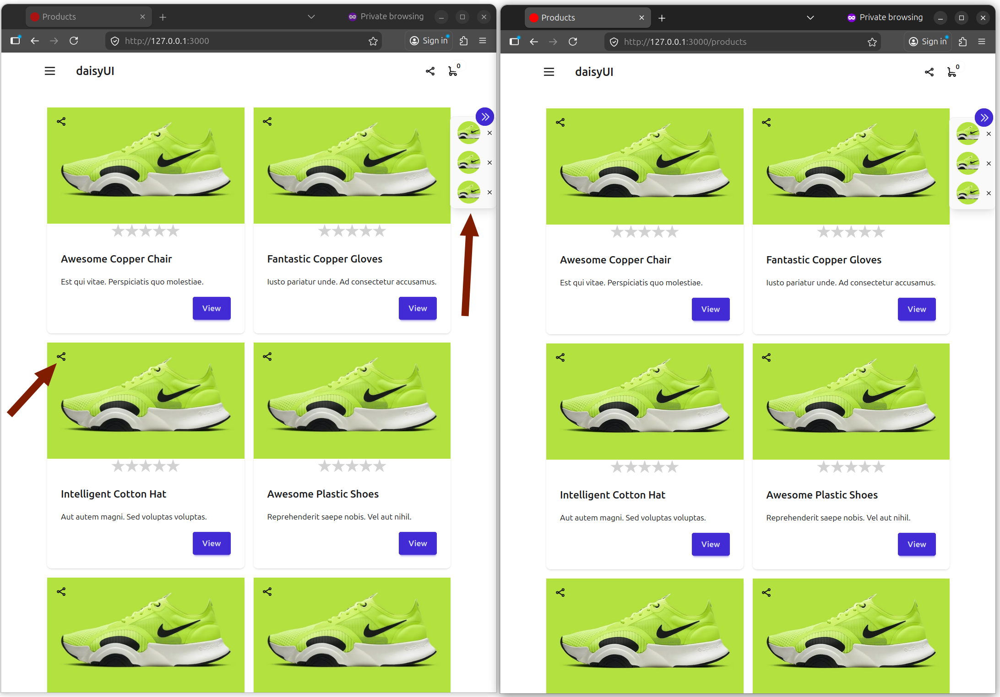
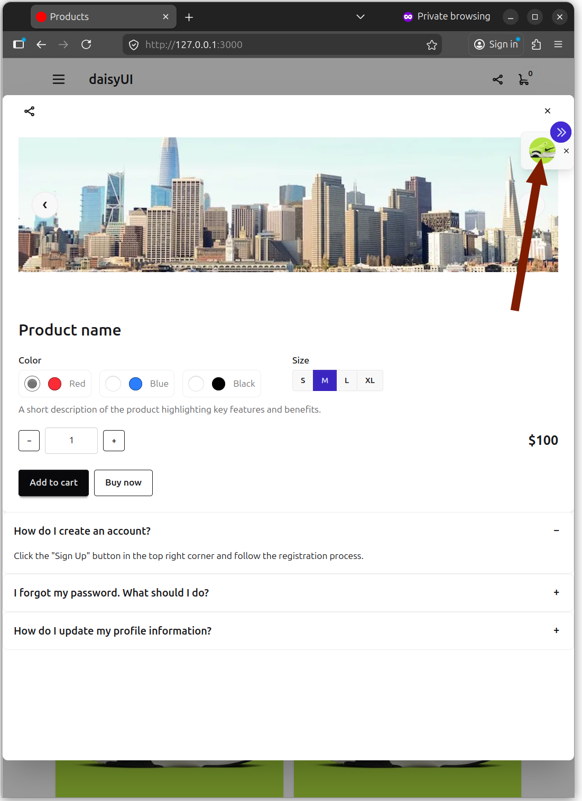
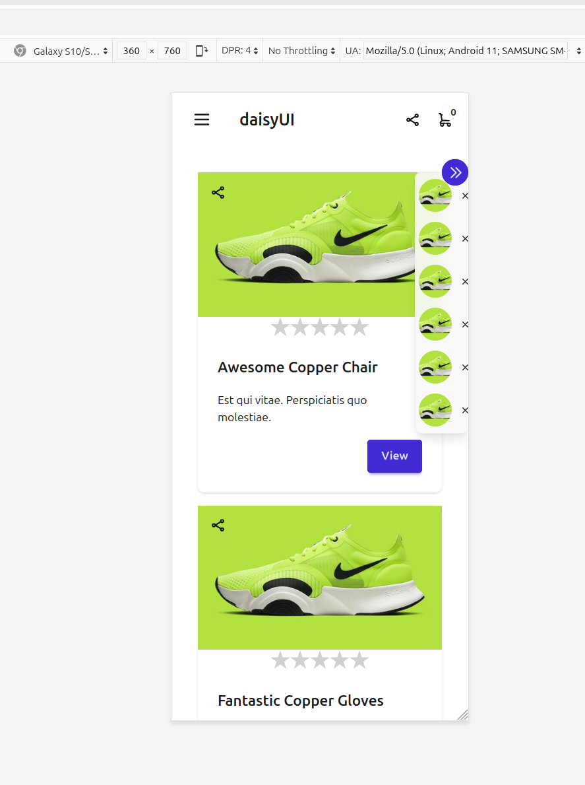

# Shared Purchase

It is a prototype without tests.

It can be useful when users are selecting a gift for someone else or collaborating on a joint purchase.

It can also function as a wishlist (turbo stream should be removed), offering a more convenient experience than opening each product in a new tab.

Users can share a link to their product list with others, enabling real-time collaborative editing—such as adding or removing items together.

They can also click on any product in the list to view its detailed information.

The user clicks the share icon in the top panel.

A popup window opens, allowing the user to copy a link to share with others for collaborative purchasing.

A share icon is displayed on every product card. When clicked, the selected product appears in the right-hand panel.

When a product icon in the right panel is clicked, a popup window opens to display the product details.

# UI

AI is used to assist in developing the UI.

The interface is fully responsive, ensuring a seamless experience across devices.

The UI is built using Tailwind CSS, with the DaisyUI component library.

# Run a server

Run the following command to start the server.

./bin/dev

# Migrations

added folders:

  - cable_migrate
  - cache_migrate
  - queue_migrate

generated migrations:
  - rails generate migration InitCable
  - rails generate migration InitCache
  - rails generate migration InitQueue

copied to corresponding migration folders

run:
  - rails db:create:cache
  - rails db:create:cable
  - rails db:create:queue

# Seeds

rails db:seed
